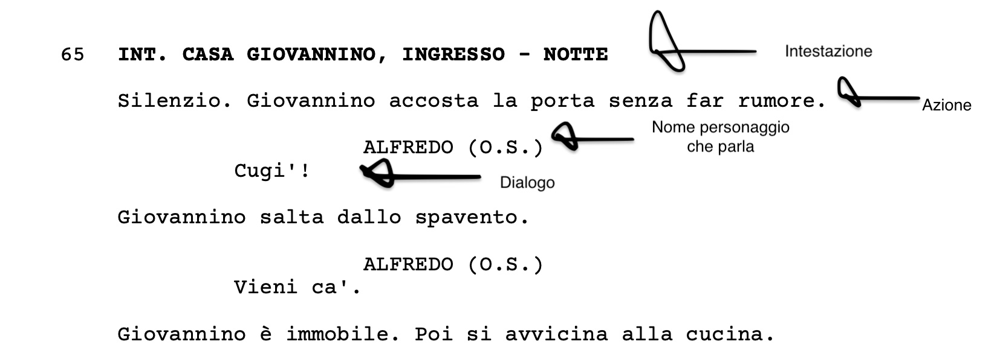

## Pagina 1 - Screenwriterer

Un editor di testo, con alcune differenze. Attraverso shortcuts tipo ctrl+1, ctrl+2... sposti il cursore nella rispettiva posizione. La formattazione è fondamentale nelle sceneggiature, e segue uno schema preciso.

 

- CTRL+1: intestazione della scena: indichi INT. o EXT. (che dovrebbero comparire automaticamente tipo auto-compile), poi il nome della location (ogni luogo si mette in un database, così con l'auto complete ricompare) e infine la luce (NOTTE, GIORNO, ALBA, TRAMONTO)
  
- CTRL + 2: l'azione, ossia la descrizione di quello che succede.
  
- CTRL + 3: il nome del personaggio. Anche questo ogni volta va aggiunto in un database così lo si raggiunge facilmente con l'auto complete. Formattato al centro.
  
- CTRL + 4: il dialogo. Formattato come vedi.
  
Questi i comandi di base, poi ne aggiungeremo di altri mano mano, tipo:

- CTRL + 0: testo normale, non formattato
- CTRL + 5: parentethical
- CTRL + 6: transizione

Sarebbe fico che l'user potesse personalizzare il tutto.

---
Link utili per i dati tecnici della formattazione:
- https://www.nfi.edu/screenplay-format/
- https://jotterpad.app/how-to-format-a-screenplay/
